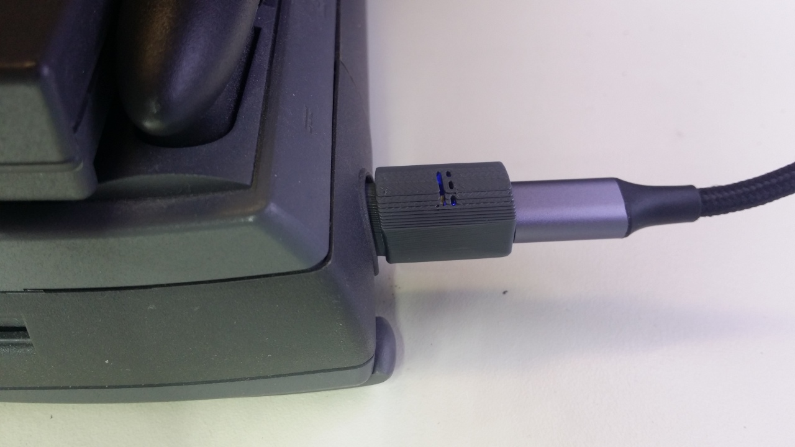

# DIY Power Connector and USB-C adapter for PowerBook 500 Series

Copyright 2022-2025

Licence: CC-BY-NC-SA

## WARNING: Do NOT power Vbatt (pin 1) without a current limiter circuit, it will overheat the battery!!!

## References

- https://tinkerdifferent.com/threads/powerbook-5xx-usb-c-pd-adapter.4243/post-36576
- https://68kmla.org/bb/index.php?threads/powerbook-power-supply-connector-520-520c-540-540c.45148/post-558172
